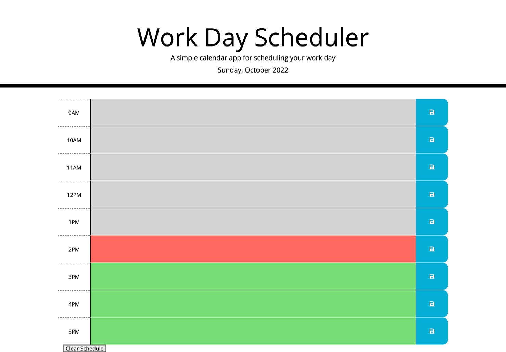

# Work Day Scheduler

## Description

The point of this project was to practice using third party APIs like Bootstrap, Moment, and jQuery. The application can be used by someone who is planning out their work day. While completing this project I learned how to loop through elements with the ability to change individual elements along the way. This is what took me the longest time. I originally wanted to try and make this happen without having to give each element a different id. However, my techniques did not work so I resorted to assigning individual ids to each.

## Table of Contents

N/A

## Installation

N/A

## Usage

Once the app is loaded the user can click into any timeblock to add their event. Once the event is in the timeblock they can press the save button. This will save their event to the schedule so they can close the window and come back to it at a later time. The user can easily see whether events are currently happening, already happend, or happening soon by the colors of the timeblocks. Future timeblocks are green, the present timeblock is red, and those in the past are gray.  At the end of the work day the user can press the clear schedule button in order to get a fresh page.

Deployed Site:
https://codysaal.github.io/work-day-scheduler/

## Credits

I found the icon for the save button at FontAwesomeIcons.
https://fontawesomeicons.com/save#!

I found the readme template at:
https://coding-boot-camp.github.io/full-stack/github/professional-readme-guide

## License

N/A